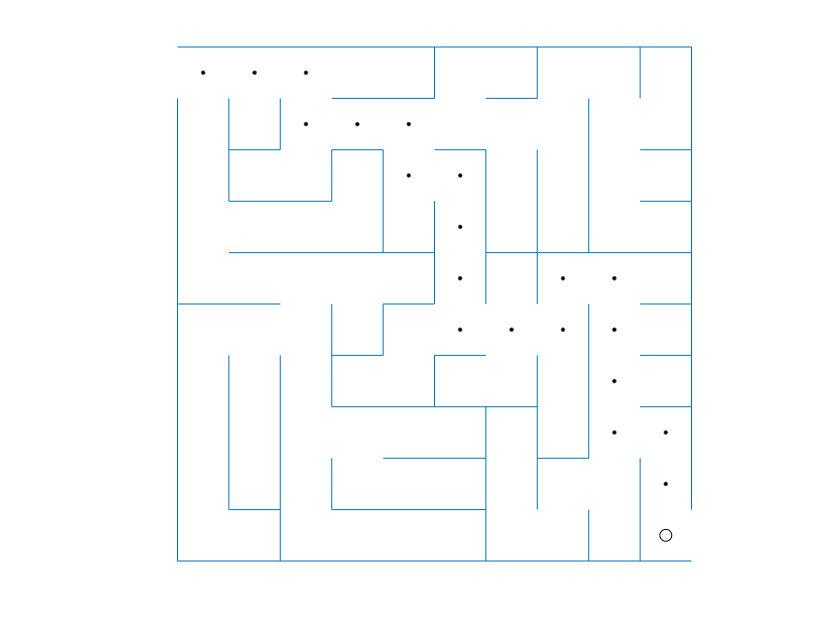

# dfsMatlab
A MATLAB implementation of the depth-first-search algorithm. The algorithm can be used to efficiently find a path through a maze or similar challenges.

## Get started
The DFS algorithm is implemented in the class definition dfsCls. An example use of the DFS algorithm is provided in the live script dfs_example.